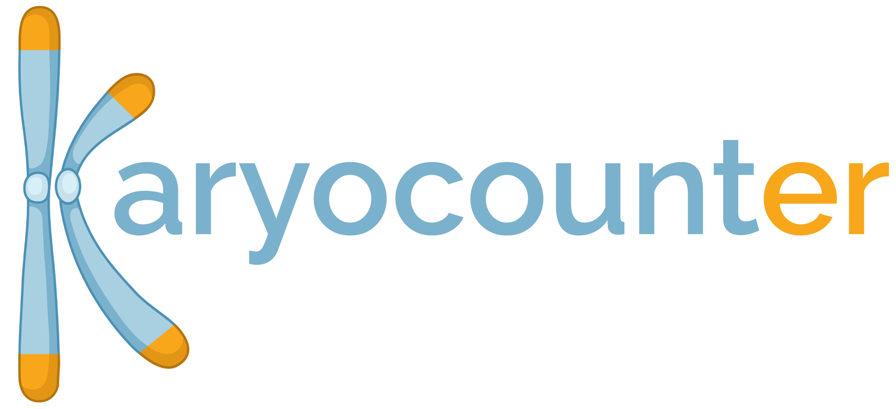
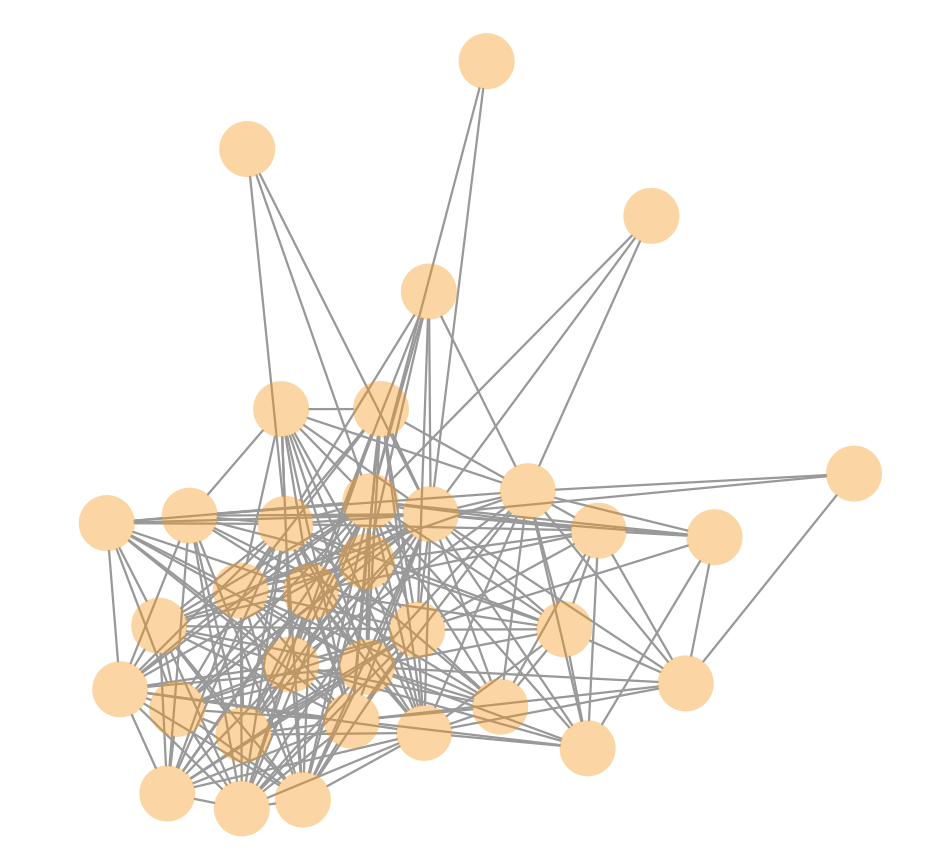
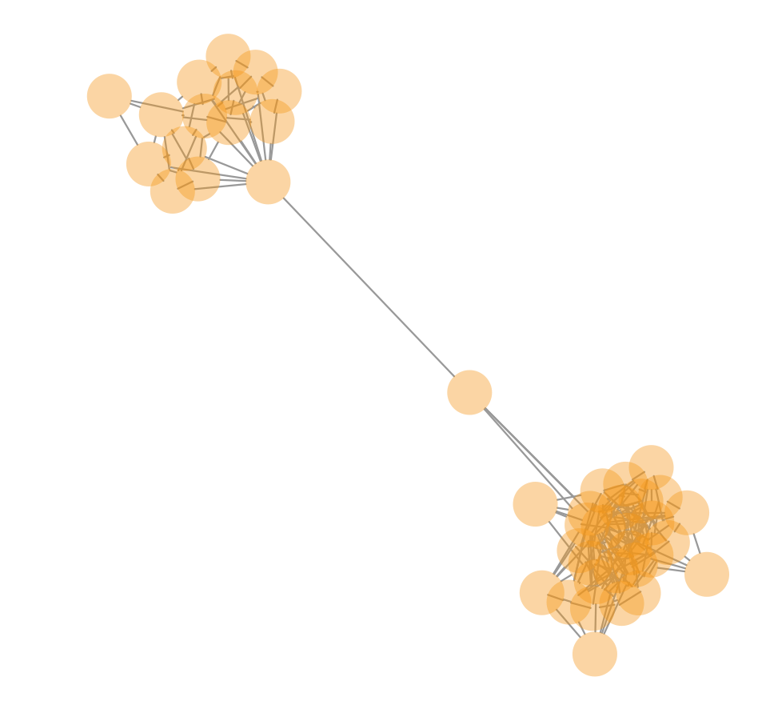

<p align="center"></p>

[](https://zenodo.org/badge/latestdoi/419751237) [](https://choosealicense.com/licenses/mit/)

Karyocounter is a Nextflow pipeline to determine the number of nuclear chromosomes in eukaryotic organisms using only nanopore reads. 

### How it works

1) Long reads are filtered to retain only telomere-containing reads above a certain read length. 

2) Reads are aligned in all-vs-all mode with minimap2 and filtered to retain only full length alignments. 

3) A network graph of the overlaps is generated where each represent cluster represents the end of a single chromosome. 

4) The number of chromosomes can then be counted and interpreted according to the biology of the organism (diploid, haploid, special cases, etc...). 

### Quick start 

1) Install [Nextflow](https://www.nextflow.io/) and ensure the following dependencies are available in your path: [seqtk](https://github.com/lh3/seqtk), [minimap2](https://github.com/lh3/minimap2), and the R programming language with [iGraph library](https://igraph.org/r/) installed.

2) Run the Nextflow pipeline. 

Easy mode: 

```
nextflow run dgiguer/long-read-karyocounting --reads /path/to/reads -r main
```

After a :coffee: and reading the parameters section:
```
nextflow run dgiguer/long-read-karyocounting -r main --reads /path/to/reads \
    --threads 12 --minimumReadLength 50000 --queryCoverage '0.95' \
    --telomere "AACCCT" --dir karyocounting_results
```

### Parameters

Reducing the number of reads used as much as possible will improve speed (minimum 50-75X coverage). This is very dependent on the read N50 obtained during sequencing. The output will be saved in your current working directory as `lrk_output`

- `--reads`: absolute path to file containg long read (.fastq.gz, .fastq).  
- `--threads`: number of threads to use. Integer, default: 4.   
- `--minimumReadLength`: read length to filter reads by. This should be as high as possible to retain only about ~50-75X coverage, depending on your read length N50. Integer, default: 4.   
- `--queryCoverage`: minimum proportion of read that aligns to another read. Character, default: '0.95'  
- `--telomere`: sequence of telomere repeat to be searched for. The pipeline searches for repeats of this string and the reverse complement. Character, default: "AACCCT".   
- `--dir`: specify output directory. Input full path or current working directory as $baseDir. Character, default: "$baseDir/lrk_output/".  

### What this pipeline can and can't do

This pipeline can:  
- enable you to determine the number of nuclear linear chromosomes in a eukaryotic organism.   
- generates a network graph and plots each connected component separately  

This pipeline can not (currently):  
- determine the ploidy of your organism  
- automatically report the number of chromosomes. This depends on the expected ploidy. We have also found some organisms expected to be diploid contain one chromosome without haplotypes distinguishable by sequence identity.

### Tutorial

An example dataset is available at NCBI Bioproject PRJNA773800, and sequencing reads can be [downloaded here.](https://trace.ncbi.nlm.nih.gov/Traces/sra/?run=SRR16970468)

The read N50 for this dataset was approximately 6 kb. The read length minimum is therefore left as 5 kb to ensure there is enough sequencing reads for each telomere. 

Run the analysis: 

```
# download from NCBI using ncbi-toolkit
fastq-dump SRR16970468

# this takes about 15 seconds using 4 i7-11800H threads with default settings, or 3 minutes on 2017 Intel dual-core i5. 
nextflow run dgiguer/long-read-karyocounting --reads /home/dangiguere/Documents/lrk_testing/SRR16970468.fastq -r main
```

The output will be in the `lrk_output` folder, containing several files: 

1) The filtered overlaps generated
2) A .pdf of all components found
3) A histogram of the number of reads in each component. 

Since there are 14 well-behaved components, **we conclude there are seven chromosomes in this species (2 telomeres per chromosome).** 

By default, the minimum number of reads for each component is set to 10. This ensures that no false-positive alignments are counted as telomeres. 

To determine the number of telomeres, it is essential to ensure that each component contains only a single, interconnected cluster of reads since each component is enumerated as a single telomere. Multiple clusters in a single component require further interpretation. 

For example, an ideal component (i.e., cluster of telomere reads) looks highly interconnected like this: 

<p align="center"></p>

In this dataset, there are 14 telomere components, each with a single well-behaved cluster. Since DNA was extracted at a life cycle phase where it is expected to be haploid, we can conclude there are 7 chromosomes (2 telomeres per chromosome) in the organism. 

In more complex cases, we have observed a couple reasons that prevent full automation of the pipeline. 

1) Components with two clusters connected by a single read (see below) that should be counted as two telomere components instead of one:

<p align="center"></p>

2) In a special case, a diatom expected to be diploid had all chromosomes diploid, except for one, which had no haplotypes distinguishable by alignment identity. This required further interpretation. 

Edges should only exist between separate reads. However, edges can exist to and from the same read if the read is actually a duplex read reported as a simplex read (i.e., both strands of a nanopore read are sequenced but basecalled as a single read).

### Troubleshooting 

- The pipeline is taking too long: The bottleneck step is all-vs-all mapping with minimap2. Try increasing the stringency of the read length filtering. Only about 50X reads for each telomeres is required, so extra coverage will increase how much time required for all-vs-all mapping.

- Nextflow won't run because of `uncomitted changes`: See https://github.com/nf-core/scrnaseq/issues/18. 

- Bug reports, feature requests, ideas for improvement: Please [email me](dgiguer@uwo.ca) or [submit an issue!](https://github.com/dgiguer/long-read-karyocounting/issues)

